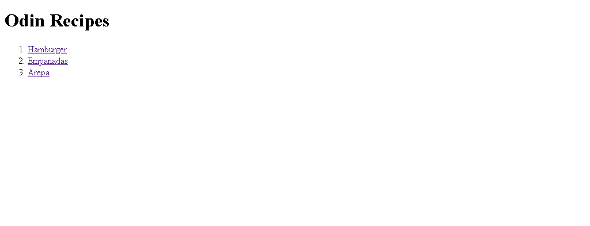

# Project Name

> This project was done with the purpose of learning how to use GitHub and at the same time everything related to gastronomy, to improve presentation skills, know and value diversity through food

Additional description about the project and its features.

## Built With

- Major languages
- Frameworks
- Technologies used

## Live Demo

[Live Demo Link](https://livedemo.com)

## Getting Started

To start, we enter our browser and place github to enter my repositories, copy the code, enter the local disk c and then look for the odin folder, enter it and then open git bash and make a git clone

To get a local copy up and running follow these simple example steps.

### Prerequisites

### Setup

### Install

To get a local copy up and running follow these simple example steps.

### Prerequisites

### Setup

### Install

### Usage

### Run tests

### Deployment

## Authors

👤 **Maria Auxiliadora Maldonado Gelvez**

- GitHub: [@auxili25](https://github.com/auxili25)

## 🤝 Contributing

Contributions, issues, and feature requests are welcome!

Feel free to check the [issues page](issues/).

## Show your support

Give a ⭐️ if you like this project!

## Acknowledgments

- I thank Professor Aristides for his teaching and his time

## 📝 License

This project is [CC0 1.0 Universal](LICENSE) licensed.